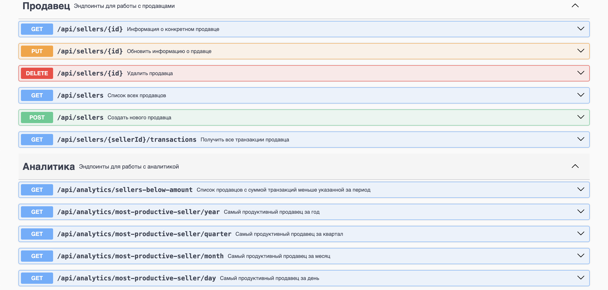
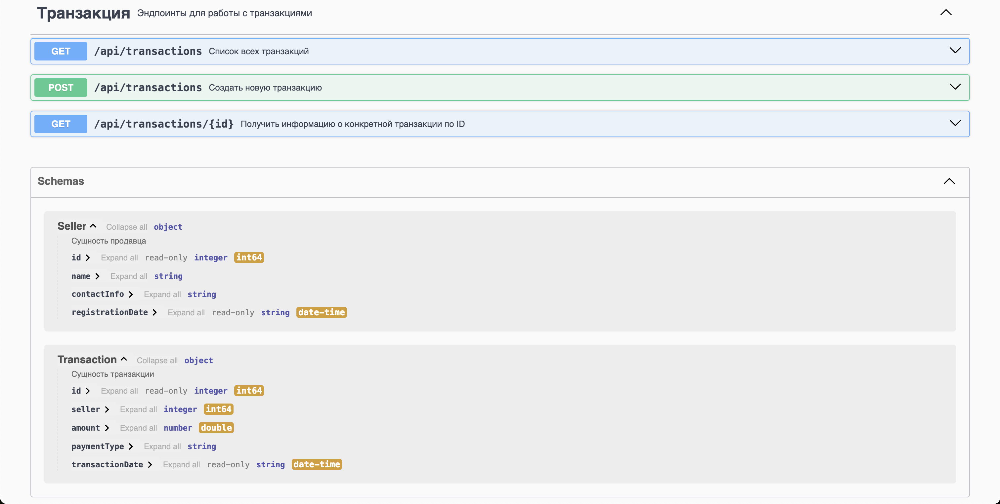

# CRM Shift Lab

## Описание проекта

CRM-система для управления информацией о продавцах и их транзакциях. Поддерживает CRUD-операции (создание, чтение, обновление, удаление) для продавцов и транзакций, а также функции аналитики для обработки и анализа данных.

## Функциональность

### Реализованные API методы:

- Получить список всех продавцов
- Получить информацию о конкретном продавце
- Создать нового продавца
- Обновить информацию о продавце
- Удалить продавца
- Получить список всех транзакций
- Получить информацию о конкретной транзакции
- Создать новую транзакцию
- Получить все транзакции продавца
- Получить самого продуктивного продавца
- Получить список продавцов с суммой транзакций меньше указанной

### Документирование API

Для документирования API используется **Swagger**. Подробное описание эндпоинтов доступно в Swagger UI после запуска приложения. Для этого нужно перейти по эндпоинту **/swagger-ui/index.html**. Ниже приведены скриншоты:



## Инструкция по сборке и запуску

### Требуемые версии

- **Gradle**: 8.12.1
- **JDK**: 17
- **PostgreSQL**: установленный и настроенный

### Подготовка базы данных

Перед запуском необходимо создать файл `application.properties` в каталоге `src/main/resources/`, указав настройки подключения к PostgreSQL:

```properties
spring.application.name=crm-shift-lab
spring.datasource.url=jdbc:postgresql://localhost:5432/your-db
spring.datasource.username=your-username
spring.datasource.password=your-password
spring.datasource.driver-class-name=org.postgresql.Driver
```

### Сущности базы данных

#### Продавец (Seller):

- **id**: Уникальный идентификатор (целое число, автоинкремент).
- **name**: Имя продавца (строка).
- **contactInfo**: Контактная информация (строка).
- **registrationDate**: Дата и время регистрации (LocalDateTime).

#### Транзакция (Transaction):

- **id**: Уникальный идентификатор (целое число, автоинкремент).
- **seller**: Ссылка на продавца (внешний ключ).
- **amount**: Сумма транзакции (десятичное число).
- **paymentType**: Тип оплаты (CASH, CARD, TRANSFER).
- **transactionDate**: Дата и время совершения транзакции (LocalDateTime).

### Запуск проекта

Выполните следующие команды в корне проекта:

```sh
./gradlew build
./gradlew bootRun
```

## Зависимости

Файл `build.gradle` содержит необходимые зависимости:

```gradle
implementation 'org.springframework.boot:spring-boot-starter-data-jpa'
implementation 'org.springframework.boot:spring-boot-starter-web'
implementation 'org.springdoc:springdoc-openapi-starter-webmvc-ui:2.8.3'
runtimeOnly 'org.postgresql:postgresql'
testRuntimeOnly 'org.junit.platform:junit-platform-launcher'
testImplementation 'org.springframework.boot:spring-boot-starter-test'
testImplementation 'org.springframework.boot:spring-boot-starter-web'
testImplementation 'org.mockito:mockito-core'
testImplementation 'org.junit.jupiter:junit-jupiter-api'
testImplementation 'org.junit.jupiter:junit-jupiter-engine'
```

### Описание зависимостей:

- **Spring Boot Starter Data JPA** — работа с базами данных через JPA.
- **Spring Boot Starter Web** — создание REST API.
- **Springdoc OpenAPI** — документирование API с использованием Swagger UI.
- **PostgreSQL Driver** — драйвер базы данных PostgreSQL.
- **JUnit & Mockito** — тестирование приложения.

## Примеры использования API

После запуска системы можно открыть [Swagger UI](http://localhost:8080/swagger-ui.html) и выполнить API-запросы.

